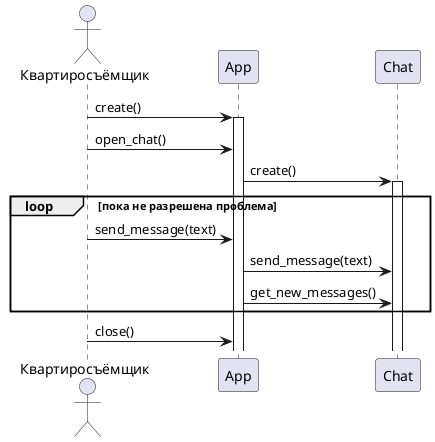

# Диаграмма последовательности прецедента "Связь с владельцем"

<!--

```plantuml
@startuml

actor Квартиросъёмщик

Квартиросъёмщик -> App : create()
activate App
Квартиросъёмщик -> App : open_chat()
App -> Chat : create()
activate Chat
loop пока не разрешена проблема
Квартиросъёмщик -> App : send_message(text)
App -> Chat : send_message(text)
App -> Chat : get_new_messages()
end
Квартиросъёмщик -> App : close()

@enduml
```
-->
