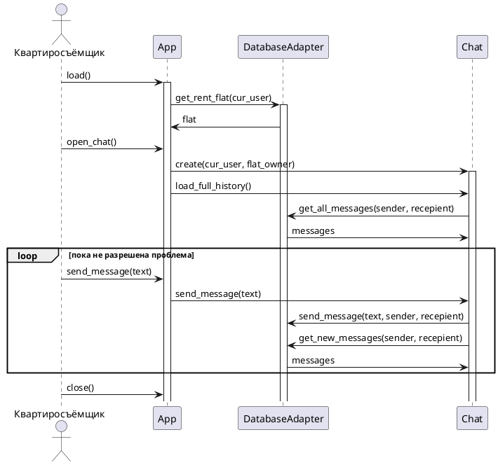

# Диаграмма последовательности прецедента "Связь с владельцем"

<!--

```plantuml
@startuml

actor Квартиросъёмщик

Квартиросъёмщик -> App : load()
activate App
App -> DatabaseAdapter : get_rent_flat(cur_user)
activate DatabaseAdapter
App <- DatabaseAdapter : flat
Квартиросъёмщик -> App : open_chat()
App -> Chat : create(cur_user, flat_owner)
activate Chat
App -> Chat : load_full_history()
Chat -> DatabaseAdapter : get_all_messages(sender, recepient)
Chat <- DatabaseAdapter : messages
loop пока не разрешена проблема
Квартиросъёмщик -> App : send_message(text)
App -> Chat : send_message(text)
Chat -> DatabaseAdapter : send_message(text, sender, recepient)
Chat -> DatabaseAdapter : get_new_messages(sender, recepient)
Chat <- DatabaseAdapter : messages
end
Квартиросъёмщик -> App : close()

@enduml
```
-->
