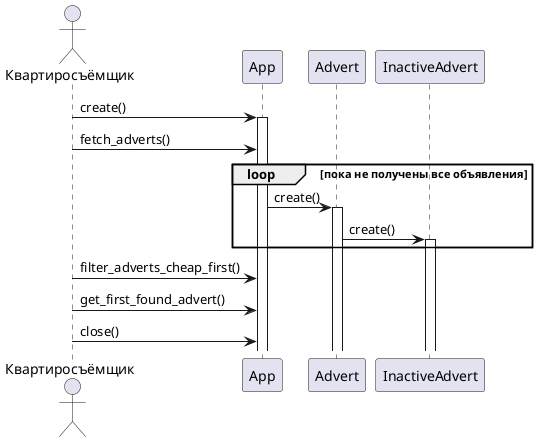

# Диаграмма последовательности прецедента "Поиск жилья"

<!--

```plantuml
@startuml

actor Квартиросъёмщик

Квартиросъёмщик -> App : create()
activate App
Квартиросъёмщик -> App : fetch_adverts()
loop пока не получены все объявления
App -> Advert : create()
activate Advert
Advert -> InactiveAdvert : create()
activate InactiveAdvert
end
Квартиросъёмщик -> App : filter_adverts_cheap_first()
Квартиросъёмщик -> App : get_first_found_advert()
Квартиросъёмщик -> App : close()

@enduml
```
-->
