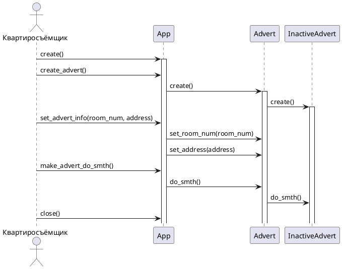

# Диаграмма последовательности прецедента "Размещение объявления"

<!--

```plantuml
@startuml

actor Квартиросъёмщик

Квартиросъёмщик -> App : create()
activate App
Квартиросъёмщик -> App : create_advert()
App -> Advert : create()
activate Advert
Advert -> InactiveAdvert : create()
activate InactiveAdvert
Квартиросъёмщик -> App : set_advert_info(room_num, address)
App -> Advert : set_room_num(room_num)
App -> Advert : set_address(address)
Квартиросъёмщик -> App : make_advert_do_smth()
App -> Advert : do_smth()
Advert -> InactiveAdvert : do_smth()
Квартиросъёмщик -> App : close()

@enduml
```
-->
