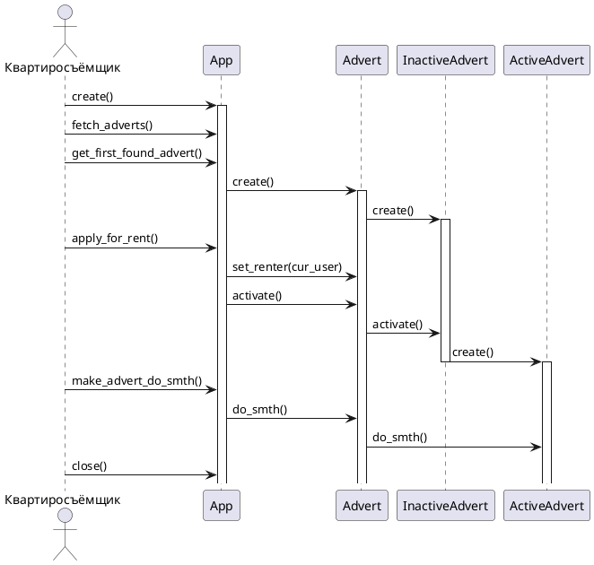

# Диаграмма последовательности прецедента "Аренда квартиры"

<!--

```plantuml
@startuml

actor Квартиросъёмщик

Квартиросъёмщик -> App : create()
activate App
Квартиросъёмщик -> App : fetch_adverts()
Квартиросъёмщик -> App : get_first_found_advert()
App -> Advert : create()
activate Advert
Advert -> InactiveAdvert : create()
activate InactiveAdvert
Квартиросъёмщик -> App : apply_for_rent()
App -> Advert : set_renter(cur_user)
App -> Advert : activate()
Advert -> InactiveAdvert : activate()
InactiveAdvert -> ActiveAdvert : create()
deactivate InactiveAdvert 
activate ActiveAdvert
Квартиросъёмщик -> App : make_advert_do_smth()
App -> Advert : do_smth()
Advert -> ActiveAdvert : do_smth()
Квартиросъёмщик -> App : close()

@enduml
```
-->
