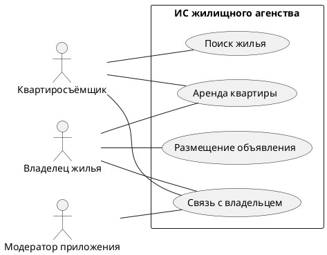

# Диаграмма прецедентов UML для информационной системы жилищного агентства

<!--

```plantuml
@startuml
skinparam packageStyle rect
left to right direction

:Квартиросъёмщик:
:Владелец жилья:
:Модератор приложения:

package "ИС жилищного агенства" {

(Размещение объявления)
(Поиск жилья)
(Аренда квартиры)
(Связь с владельцем)

}

:Квартиросъёмщик: -- (Поиск жилья)
:Квартиросъёмщик: -- (Аренда квартиры)
:Квартиросъёмщик: -- (Связь с владельцем)

:Владелец жилья: -- (Размещение объявления)
:Владелец жилья: -- (Аренда квартиры)
:Владелец жилья: -- (Связь с владельцем)

:Модератор приложения: -- (Связь с владельцем)

@enduml
```
-->
